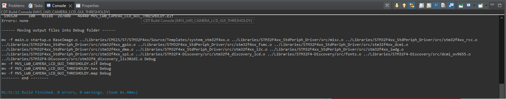

## Данный репозиторий предназначен для установки Eclipse IDE и его программного окружения для МВС или ММВП

1. [Установка Eclipse IDE](#установка-eclipse-ide)
2. [Установка зависимостей для работы Eclipse IDE и его настройка](#установка-зависимостей-для-работы-eclipse-ide-и-его-настройка)
3. [Установка STM32 ST-Link Utility](#установка-stm32-st-link-utility)
4. [Установка Image2Lcd](#установка-image2lcd)
5. Окружения для МВС: https://drive.google.com/drive/folders/1WPKVIQYUYt895byzjXsBngXMgMqNV-V8 **(на примере используется данное окружение)**
6. Окружение для ММВП: https://drive.google.com/drive/u/0/folders/1BkDrSrnkldEwhkS1TwDfKxCUjNE2eGjB

## Установка Eclipse IDE

Качаем Eclipse IDE по ссылке (official site): https://www.eclipse.org/downloads/download.php?file=/oomph/epp/2023-09/R/eclipse-inst-jre-win64.exe

Устанавливаем (обязательно) `Eclipse IDE for Embedded C/C++ Developers`:

После скачивания необходимо открыть Eclipse IDE, выбрать любое место для рабочей директории.

---

**ВНИМАНИЕ! Чтобы проекты билдились, необходимо папку Libraries из MVS/ММВП положить в корневой каталог рабочей директории**

---

Пробуем сбилдить проект и получаем ошибку:

Теперь переходим к установке зависимостей.

## Установка зависимостей для работы Eclipse IDE и его настройка

Установка зависимостей. Тут нам понадобится 2 программы:
1. MinGW: [MinGW.exe](./files/mingw.exe)
2. GCC ARM Node Eabi 4.6 2012q4-update: [gcc-arm-none-eabi-4_6-2012q4-20121016.exe](./files/gcc-arm-none-eabi-4_6-2012q4-20121016.exe)

После скачивания открываем MinGW и следуем инструкции:
1. Install
2. Путь: C:\MinGW **(путь менять ЗАПРЕЩЕНО, в противном случае - придется заменять его в дальнейшей инструкции)**
3. Continue (ничего не меняем)
4. Ожидаем загрузки (окно инсталятора противное, поэтому оно само дальше не пойдет, жмем **Continue**)
5. Вылазит окно, где во вкладке Basic Setup необходимо поставить все галочки (вообще необходимо только g++ (gcc), но перестрахуемся)
6. После того как поставили все галочки жмем Installation --> Apply Changes
7. Ждем загрузки

Результат должен быть такой:

Далее открываем `gcc-arm-none-eabi-4_6-2012q4-20121016.exe`:

Следуем инструкции:
1. English
2. Yes
3. Next
4. "I accept the terms of the license agreement" + Next
5. Путь не меняем, Next
6. Next
7. Убираем все галочки и жмем "Finish"

Далее закидываем две эти софтины в PATH

1. Жмем Win + R, sysdm.cpl --> Дополнительно --> Переменные среды
2. Path (изменить)

**Внимание! Желательно изменять оба PATH (как для пользователя, под которым вы сидите, так и для администратора). Как правило, PATH пользователя - сверху, администратора - снизу**

3. Создать

Прописываем в Path следующее:
1. C:\MinGW
2. C:\MinGW\bin
3. C:\MinGW\msys\1.0\bin
4. C:\Program Files (x86)\GNU Tools ARM Embedded\4.6 2012q4\bin

Результат:

Жмем ОК, ОК, Применить, ОК

После чего заходим в Eclipse, пытаемся сбилдить проект и видим:

Ошибка. Не хватает файла. Ну такое может быть часто. В этом случае разбираемся какого файла не хватает и пытаемся его найти в ММВП / MVS.

1. Окружения для МВС: https://drive.google.com/drive/folders/1WPKVIQYUYt895byzjXsBngXMgMqNV-V8 **(на примере используется данное окружение)**
2. Окружение для ММВП: https://drive.google.com/drive/u/0/folders/1BkDrSrnkldEwhkS1TwDfKxCUjNE2eGjB

Лично я использовал на примере окружение МВС и недостающийся файл был в ММВП. Качаем его с Libraries/STMF4-Discovery/inc/stm32f4_discovery_lis3dsh.h

После чего закидываем его в наш Libraries/STMF4-Discovery/inc/stm32f4_discovery_lis3dsh.h

P.S. Недостающиеся файлы иногда можно искать в гугле, гитхабе и иных источниках.

Пытаемся сбилдить проект:

Готово. Самое противное сделано!

## Установка STM32 ST-Link Utility

Просто скачать с моего репо, в установке нет ничего сложного: [download](./files/STM32%20ST-LINK%20Utility_v2.3.0.exe)

Инструкция по использованию:
1. Подключаем микроконтроллер
2. Открываем программу (можно просто открыть, можно через эклипс)
3. Target --> Program
4. Загружаем *.hex файл, который сбилдился благодаря Eclipse
5. Жмем CheckBox "Reset After Programming"
6. Прошиваем

## Установка Image2Lcd

Скачать с моего репо: [download](./files/Image2Lcd.rar)

Разархивируем в любую папку. Далее раскажу про активацию. Если делать лабы и не активировать его, то на всех кнопках и картинках будет зловещая надпись Image2LCD, которая в большинстве случаев перекрывает картинку.

Копируем из `activation_key.txt` содержимое файла: `0000-0000-0000-0000-6A3B`. **ОТ ИМЕНИ АДМИНИСТРАТОРА** Заходим в Image2LCD, жмем Register, вставляем ключ, перезаходим и проверяем. Перед каждой конвертацией проверять лицензию, очень часто слетает. Он у меня почему-то стал запускаться 2 года.

После чего успешная активация:

